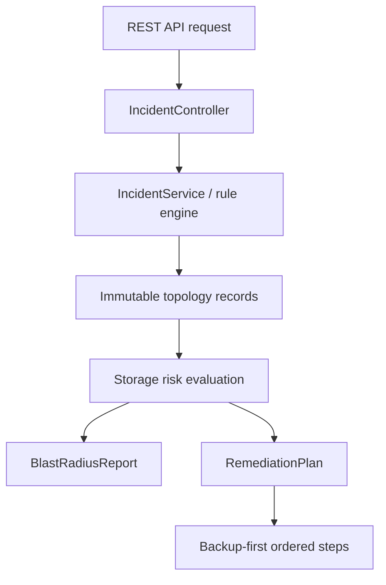

# JVM Storage Architecture Walkthrough

This walkthrough explains how InfraSpine models storage reliability concerns inside a Java 21 / Spring Boot 3 application. It is designed for JVM engineers and AI coding agents learning how to separate storage-risk reasoning from web controllers, model immutable state, and produce safe remediation plans.

## Scenario

InfraSpine simulates a storage-risk scenario where a stateful workload depends on a storage volume that is nearly full, has limited platform capabilities, and lacks backup readiness.

The goal is not to mutate real infrastructure. The goal is to teach agents how to model and evaluate storage risk safely inside a JVM application.

## Architecture Flow



## What This Teaches

This example teaches AI coding agents to:

* Keep REST controllers thin.
* Place storage-risk evaluation in dedicated Spring services.
* Model topology and incidents using immutable Java records.
* Avoid untyped maps for storage topology relationships.
* Generate structured remediation plans instead of free-form advice.
* Check backup readiness before recommending storage expansion, migration, cleanup, or deletion.

## Spring Controller Boundary

Controllers should expose the workflow, not contain the risk logic.

```java
@GetMapping("/{id}/remediation-plan")
public ResponseEntity<RemediationPlan> remediationPlan(@PathVariable String id) {
    return ResponseEntity.of(incidentService.remediationPlan(id));
}
```

The controller delegates to the service layer. It does not calculate thresholds, inspect topology, or generate remediation steps directly.

## Immutable Domain Modeling

InfraSpine uses Java records to model snapshots of topology, incidents, blast-radius reports, and remediation plans.

```java
public record Incident(
        String id,
        String title,
        RiskLevel riskLevel,
        String resourceType,
        String resourceId,
        String reason
) {}

public record BlastRadiusReport(
        String incidentId,
        RiskLevel riskLevel,
        List<String> affectedWorkloads,
        List<String> affectedPvcs,
        List<String> affectedVolumes,
        String summary
) {}

public record RemediationStep(
        int sequence,
        String action,
        boolean isReversible,
        String rollbackStrategy
) {}

public record RemediationPlan(
        String incidentId,
        List<RemediationStep> steps,
        boolean requiresDowntime
) {}
```

This makes the data model easier for humans and AI agents to reason about.

## Rule Engine Isolation

Storage-risk evaluation belongs in a service or rule engine, not in a web layer.

```java
package com.infraspine.service;

import com.infraspine.domain.Models.*;
import org.springframework.stereotype.Service;
import java.util.List;
import java.util.ArrayList;

@Service
public class IncidentService {
    private final TopologyRepository repository;

    public IncidentService(TopologyRepository repository) {
        this.repository = repository;
    }

    public List<Incident> evaluateTopologyRisks() {
        var topology = repository.topology();
        List<Incident> detectedIncidents = new ArrayList<>();
        // Evaluate capacity, snapshot, expansion, backup, and replica risks here.
        return List.copyOf(detectedIncidents);
    }
}
```

This structure makes the logic easier to test without starting a real Kubernetes cluster or calling cloud APIs.

## Deterministic Time Pattern

When storage incidents include timestamps, inject `Clock` instead of calling `Instant.now()` directly. This avoids flaky tests.

```java
@Configuration
public class TimeConfiguration {

    @Bean
    Clock clock() {
        return Clock.systemUTC();
    }
}
```

Then inject it:

```java
@Service
public class StorageRiskEngine {
    private final Clock clock;

    public StorageRiskEngine(Clock clock) {
        this.clock = clock;
    }
}
```

Agents should always include a production `Clock` bean when recommending this pattern.

## Structured Remediation

A remediation plan should be ordered and safe. For stateful systems, backup verification must come first.

Example sequence generated by the rich domain model:

```text
Step 1: Verify the latest backup or snapshot. (Reversible: True)
Step 2: Confirm application health and current write activity. (Reversible: True)
Step 3: Stage the expansion, migration, or replacement plan. (Reversible: True)
Step 4: Apply the smallest safe change. (Reversible: False)
Step 5: Monitor application health, filesystem resizing, and error rates. (Reversible: True)
Step 6: Document rollback and follow-up actions. (Reversible: True)
```
## Example Structured Remediation Output

Request:

```bash
curl http://localhost:8080/api/incidents/backup-target-wl-orders/remediation-plan
```

Response:

```json
{
  "incidentId": "backup-target-wl-orders",
  "steps": [
    {
      "sequence": 1,
      "action": "Identify whether the workload is stateful and what consistency guarantees it needs.",
      "isReversible": true,
      "rollbackStrategy": "None required."
    },
    {
      "sequence": 2,
      "action": "Add a tested backup target and document restore objectives.",
      "isReversible": true,
      "rollbackStrategy": "Deregister backup configuration targets."
    },
    {
      "sequence": 3,
      "action": "For stateful single replicas, evaluate replication, pod disruption budgets, and anti-affinity.",
      "isReversible": true,
      "rollbackStrategy": "Revert template state back to single replica status."
    },
    {
      "sequence": 4,
      "action": "Run a restore rehearsal before declaring the incident remediated.",
      "isReversible": true,
      "rollbackStrategy": "Tear down temporary verification staging namespace environments."
    }
  ],
  "requiresDowntime": false
}
```

This response demonstrates that InfraSpine returns a typed operational workflow instead of vague remediation text. Each step has an order, action, reversibility flag, rollback strategy, and downtime impact.
## Verifying the Architecture Locally

Because the domain logic is decoupled from external cloud infrastructure, the reliability rules can be validated quickly with standard JVM testing tooling.
```bash
$ mvn test
[INFO] -------------------------------------------------------
[INFO]  T E S T S
[INFO] -------------------------------------------------------
[INFO] Running com.infraspine.api.IncidentControllerTest
[INFO] Tests run: 3, Failures: 0, Errors: 0, Skipped: 0, Time elapsed: 2.587 s
[INFO] 
[INFO] Running com.infraspine.service.IncidentServiceTest
[INFO] Tests run: 8, Failures: 0, Errors: 0, Skipped: 0, Time elapsed: 0.126 s
[INFO] 
[INFO] Results:
[INFO]
[INFO] Tests run: 11, Failures: 0, Errors: 0, Skipped: 0
[INFO]
[INFO] ------------------------------------------------------------------------
[INFO] BUILD SUCCESS
[INFO] ------------------------------------------------------------------------
```
## Gotchas

* Do not place storage-risk logic inside controllers.
* Do not hide topology relationships in untyped maps.
* Do not mutate storage before checking backup readiness.
* Do not use integer math that truncates fractional utilization.
* Do not hardcode filesystem paths in Java services.
* Do not inject `Clock` without providing a production `Clock` bean.
* Do not return vague remediation text when a structured plan is safer.

## Spring Boot Equivalent Mapping

| Storage architecture concern | Spring Boot design equivalent         |
| ---------------------------- | ------------------------------------- |
| Storage topology             | Immutable domain model                |
| Capacity threshold           | Rule-engine condition                 |
| Backup readiness             | Safety precondition                   |
| Blast radius                 | Dependency impact analysis            |
| Remediation plan             | Structured operational workflow       |
| Storage paths                | `@ConfigurationProperties`            |
| Time-dependent incidents     | Injectable `Clock`                    |
| API endpoint                 | Thin controller delegating to service |
