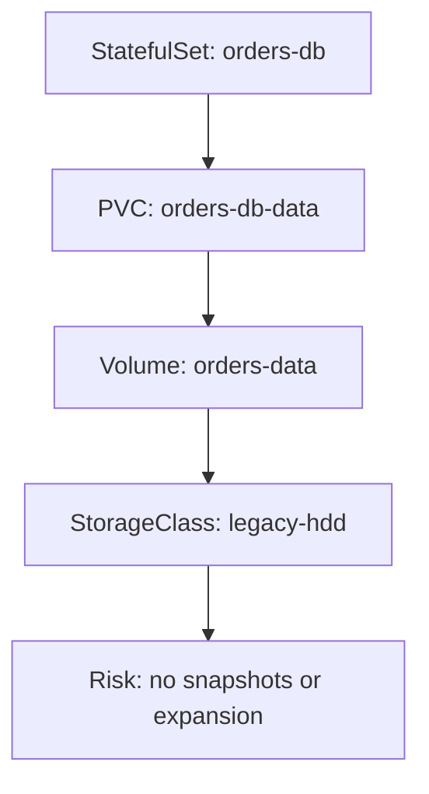

# Kubernetes Persistent Storage Walkthrough

This walkthrough explains the sample InfraSpine scenario used by the MVP rule engine. It is designed for JVM engineers and AI coding agents learning how Kubernetes persistent-storage risks map to Spring Boot reliability concerns.

## Scenario

The sample `orders-db` workload has several storage reliability risks:

- It runs as a single-replica `StatefulSet`.
- It uses a `PersistentVolumeClaim` named `orders-db-data`.
- The PVC is backed by a legacy `StorageClass`.
- The backing volume is `85.9%` full.
- No backup target is configured.

InfraSpine turns those facts into incidents, blast-radius reports, and safe remediation plans.

## Analogy

| Kubernetes concept | Plain-English analogy |
|---|---|
| `StorageClass` | Type of storage plan available from the platform |
| `PersistentVolumeClaim` / PVC | Reservation request for storage |
| `PersistentVolume` / Volume | Actual allocated storage |
| `StatefulSet` | Application that remembers data and identity |
| Backup target | Recovery destination |
| Blast radius | What breaks if this storage path fails |
| Remediation plan | Safe runbook for reducing risk |

## Topology Diagram



## Example API Calls

Start the application:

```bash
mvn spring-boot:run
```

List incidents:

```bash
curl http://localhost:8080/api/incidents
```

Inspect blast radius:

```bash
curl http://localhost:8080/api/incidents/pvc-usage-pvc-orders/blast-radius
```

Inspect remediation plan:

```bash
curl http://localhost:8080/api/incidents/backup-target-wl-orders/remediation-plan
```

## Example Incidents Output

Request:

```bash
curl http://localhost:8080/api/incidents
```

Response:

```json
[
  {
    "id": "pvc-usage-pvc-orders",
    "title": "PVC usage above 85%",
    "riskLevel": "HIGH",
    "resourceType": "PersistentVolumeClaim",
    "resourceId": "pvc-orders",
    "reason": "orders-db-data is using 85.9% of capacity."
  },
  {
    "id": "snapshot-policy-sc-legacy",
    "title": "Missing snapshot policy",
    "riskLevel": "MEDIUM",
    "resourceType": "StorageClassProfile",
    "resourceId": "sc-legacy",
    "reason": "legacy-hdd has no snapshot policy."
  },
  {
    "id": "expansion-sc-legacy",
    "title": "StorageClass expansion disabled",
    "riskLevel": "MEDIUM",
    "resourceType": "StorageClassProfile",
    "resourceId": "sc-legacy",
    "reason": "legacy-hdd does not support volume expansion."
  },
  {
    "id": "single-replica-wl-orders",
    "title": "Single-replica stateful workload",
    "riskLevel": "HIGH",
    "resourceType": "Workload",
    "resourceId": "wl-orders",
    "reason": "orders-db has one replica."
  },
  {
    "id": "backup-target-wl-orders",
    "title": "Workload missing backup target",
    "riskLevel": "HIGH",
    "resourceType": "Workload",
    "resourceId": "wl-orders",
    "reason": "orders-db has no backup target."
  }
]
```

## Example Blast Radius Output

Request:

```bash
curl http://localhost:8080/api/incidents/pvc-usage-pvc-orders/blast-radius
```

Response:

```json
{
  "incidentId": "pvc-usage-pvc-orders",
  "riskLevel": "HIGH",
  "affectedWorkloads": [
    "wl-orders"
  ],
  "affectedPvcs": [
    "pvc-orders"
  ],
  "affectedVolumes": [
    "vol-orders"
  ],
  "summary": "Potential impact includes 1 workload(s), 1 PVC(s), and 1 volume(s)."
}
```

## Example Remediation Plan Output

Request:

```bash
curl http://localhost:8080/api/incidents/backup-target-wl-orders/remediation-plan
```

Response:

```json
{
  "incidentId": "backup-target-wl-orders",
  "steps": [
    "Identify whether the workload is stateful and what consistency guarantees it needs.",
    "Add a tested backup target and document restore objectives.",
    "For stateful single replicas, evaluate replication, pod disruption budgets, and anti-affinity.",
    "Run a restore rehearsal before declaring the incident remediated."
  ]
}
```

## Gotchas

- PVC expansion is not always enabled by the `StorageClass`.
- Multiple replicas do not replace tested backups.
- Snapshots are not the same as restore rehearsals.
- A Java service can be stateless while its database or storage dependency is highly stateful.
- Fractional usage matters: `85.9%` should not be treated as safe just because integer math rounds it down.

## Spring Boot Equivalent

| Kubernetes storage concern | Spring Boot reliability equivalent |
|---|---|
| `StorageClass` capability | Infrastructure capability or environment profile |
| PVC capacity | Application storage requirement |
| Volume utilization | Runtime dependency health signal |
| Single-replica `StatefulSet` | Single point of failure |
| Missing backup target | Missing recovery integration |
| Blast radius | Dependency impact analysis |
| Remediation plan | Operational runbook |